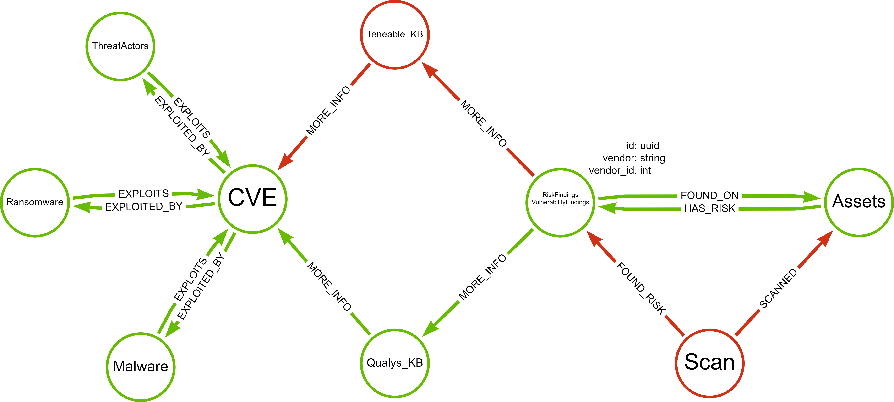

# Star Project 


# commands to create graph using csv import 

```
bin\neo4j-admin.bat database import full --overwrite-destination --nodes="import\assets_nodes_header.csv","import\assets_nodes.csv" --nodes="import\detection_nodes_header.csv","import\detection_nodes.csv" --nodes="import\qualys_kb_nodes_header.csv","import\qualys_kb_nodes.csv" --nodes="import\cve_db_nodes_header.csv","import\cve_db_nodes.csv" --nodes="import\threat_actor_nodes_header.csv","import\threat_actor_nodes.csv" --nodes="import\ransomware_nodes_header.csv","import\ransomware_nodes.csv" --nodes="import\malware_nodes_header.csv","import\malware_nodes.csv"  --relationships="import\detection_found_on_assets_rel.csv" --relationships="import\asset_has_risk_detection_rel.csv" --relationships="import\detection_to_qualys_kb_rel.csv" --relationships="import\qualys_kb_to_cve_rel.csv" --relationships="import\threat_to_cve_rel.csv" --relationships="import\cve_to_threat_rel.csv" --relationships="import\ransomware_to_cve_rel.csv" --relationships="import\cve_to_ransomware_rel.csv" --relationships="import\malware_to_cve_rel.csv" --relationships="import\cve_to_malware_rel.csv" --skip-bad-relationships --multiline-fields=true
```


# changes done after creating the graph 

- adding additional label to the following nodes 
- cve_data [Vulnerabilities]
- qualys_kb_data [Vulnerabilities]
- detections [Findings]


# Graph Schema 




# Steps to run the project 

1. Set the OPENAI_API_KEY in the enviornment 
2. Start the backend server by going to server folder and type the command `python server.py` - this will start the server 
3. Start the UI by going to streamlit_ui folder and type the command `streamlit run main.py` - this will start the UI